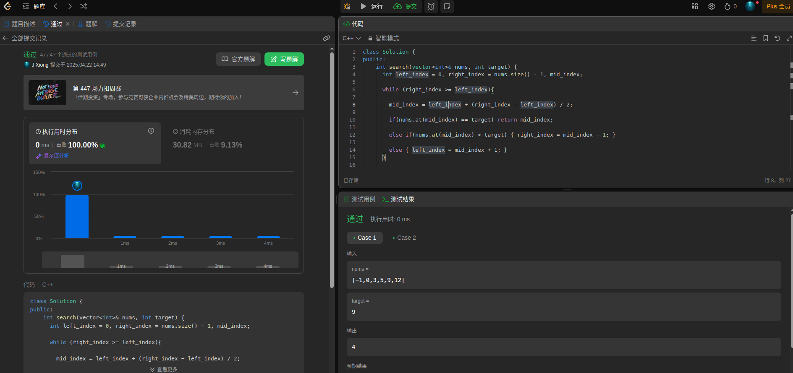
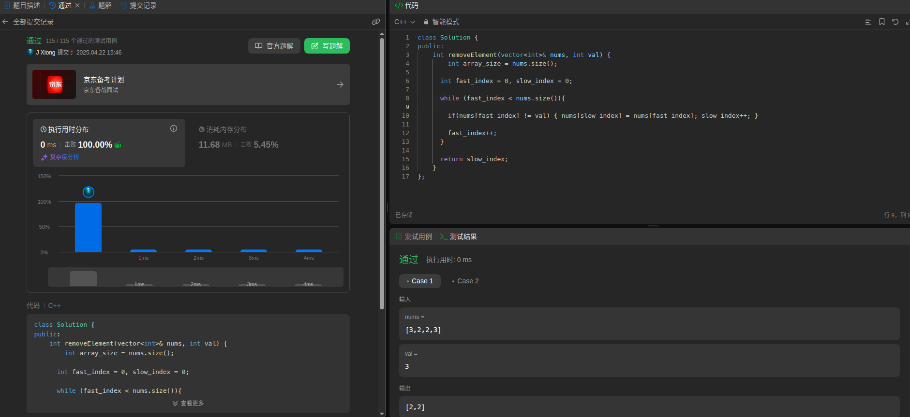
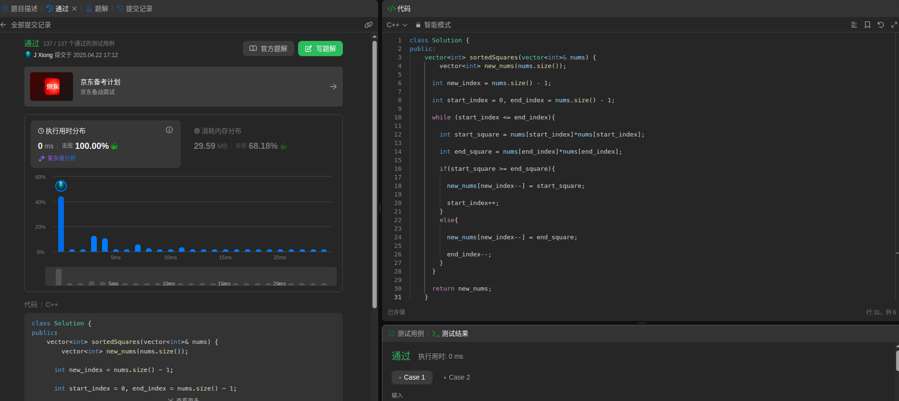

# Day1 算法训练营学习记录 - 数组篇

第一天的学习是数组操作的练习，主要考察的是对二分法、双指针法的掌握。由于之前学习过代码随想录中的数组章节，因此第一天的任务耗时1.5小时完成。

### 我学习的策略是：
    1）先复习数组的基础知识；
    2）将任务中的三道题完成，提交Leetcode进行运行测试；
    3）对每题中自己的代码进行时间复杂度和空间复杂度的分析；
    3）每完成一题，会回到代码随想录网站阅读一下相应的题的讲解分析，来巩固自己对知识的理解；
    4）整理代码，写每日博客。
---
### 第一题：二分查找
  该题做的比较顺利，因为之前对二分查找掌握地还不错。在作题前，我会先整理自己的作题思路，如下：
  #### **Idea**:
    1. 使用二分查找
    2. 二分查找的前提是 a.有序数组；b.数组中无重复元素
    3. 区间定义要明确，我比较习惯左闭右闭的方式
    4. 迭代条件要注意，left == right是有意义的
    5. 给定leftIndex, rightIndex, middleIndex
    6. 迭代更新以上值，直到给定leftIndex > rightIndex

    > 时间复杂度：O(logn)
    > 空间复杂度：O(1)

*/

---
### 第二题：移除元素
我首先使用了暴力解法（第一次通过定义新的数组实现，第二次在当前数组中，用两次for迭代实现），然后使用了双指针法。

整理自己的作题思路，如下：

#### **Idea**:

  **1. 暴力解法**
     a.定义一个新数组，遍历nums数组，不等于val的元素填入新数组
     b.将新数组的元素复制到nums中

    > 时间复杂度O(n*n)
    > 空间复杂度O(1)

  **2. 双指针法**
     a.定义快慢指针
     b.利用快指针遍历数组，当索引元素不等于目标值时，将慢指针索引元素赋值为快指针索引元素，
       慢指针索引+1，否则不变
     c.遍历结束后，慢指针索引即为不等于目标值的元素数量

    > 时间复杂度O(n)
    > 空间复杂度O(1)

---

### 第三题：有序数组的平方
该题我思考了很久，最后没有想出来，看了代码随想录里的答案。我恍然大悟，我思考的思路是如何不开新的内存去实现，但该题只要求的时间复杂度，并没有要求空间复杂度。因此这也是我没有想到解决方案的原因。

按照代码随想录里的代码，定义一个新的数组去存储平方后排好序的结果，再利用双指针去找到相应的元素填进去。这就让这道题迎刃而解。

这给我的教训是：一定要看清题目！

思路如下：

#### **Idea:**
   a.定义一个新数组，去存储最终数组
   b.对于原始的非递减数组，如果存在负值元素的情况下，首尾的元素必是平方最大值；无负值元素情况下，尾部元素是最大值；
   c.使用双指针，一个指向首，一个指向尾，遍历数组，每次迭代时将两个指针索引的元素进行对比，平方较大值存入新数组；
   d.用一个索引从后往前填充新数组

   > 时间复杂的：O(n)
   > 空间复杂度：O(n)

---

### 总结
第一天的任务相对比较轻松，但随着之后章节的深入，算法会越来越复杂。学习贵在坚持，加油！！！